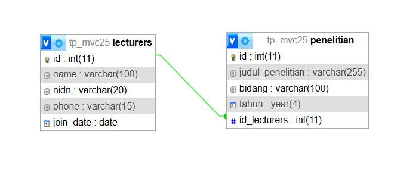
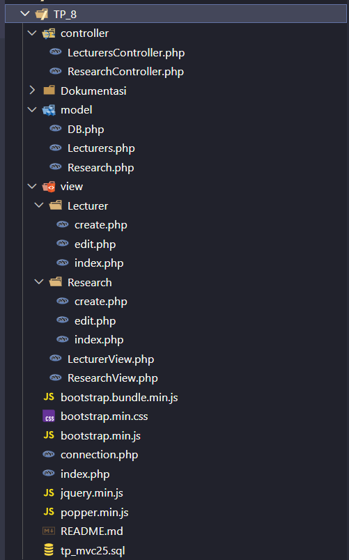

Saya Julia Rahmawati dengan NIM 2400742 mengerjakan TP 8 dalam mata kuliah Desain dan Pemrograman Berorientasi Objek untuk keberkahan-Nya maka saya tidak melakukan kecurangan seperti yang telah dispesifikasikan. Aamiin.

### Desain Program
Program ini berbasis PHP dengan arsitektur MVC(Model-View-Controller) yang mengimplementasi sederhana dari Sistem informasi manajemen dosen dan penelitian. program ini menyediakan CRUD (create, read, update, delete) untuk entitas Dosen(Lecturers) dan Penelitian(Research).

#### Desain Database
Database : tp_mvc25 adalah database yang di dalam nya terdapat dua tabel yaitu, lecturers, dan penelitian. 

#### Struktur Direktori

1. controller/ logika kontrol, mengatur alur data
2. model/ logika interaksi dengan database
3. view/ tampilan HTML/PHP
4. config/ file konfigurasi
5. tp_mvc25.sql database
6. index.php
 
### Alur Program
1. Titik Masuk dan Inisialisasi
   aplikasi ini dimulai dengan tiga titik masuk utama yang mengarahkan ke controller yang berbeda-beda.
   - index.php : halaman utama ( tetapi di program aku langsung ke tampilan dosen tidak ada tampilan khusus Dashboardnya).
   - index.php?action=lecturer : mengakses manajemen data Dosen.
   - index.php?action=research : mengakses manajemen data penelitian.
  
2. Alur Dosen(Lecturers)
   Melihat Daftar Dosen
   - User mengakses halaman dosen
   - LecturerController->index() dipanggil.
   - Model Lecturers membuka koneksi dan memanggil getLecturers() untuk mengambil           semua data dosen dari database.
   - LecturerView merender (render($data)) daftar dosen ke halaman.
   
   Menambahkan Dosen
   - User mengklik tombol "Add New Lecturer"
   - LecturerController->add() di panggil.
   - LecturerView menampilkan form create.
   - User mengisi form dan mengirimkannya (submit).
   - LecturerController->add() memproses data formulir
   - Model Lecturers memanggil add($data) untuk menambhkan data baru ke database.
   - User diarahkan kembali ke halam daftar dosen.

   Mengedit Dosen
   - User mengkilk tombol "Edit" untuk dosen tertentu.
   - LecturerController->edit() di panggil.
   - Controller mengambil data dosen berdasrkan id dan LecturerView menampilkan form        edit yang sudah terisi dengan data yang sebelumnya.
   - User memperbarui form dan mengirimkannya (submit).
   - LecturerController->edit() memproses data form dan id.
   - Model Lecturers memanggil update($id, $data) untuk memperbarui data di database.
   - User di arahkan kembali ke halam dafatr dosen.

   Menghapus Dosen
   - User mengklik tombol "Delete" untuk dosen.
   - LecturerController-delete() dipanggil, mengambil id.
   - Controller memanggil Model Lecturers (delete($id)) untuk mengahapus baris data         dari database.
   - User diarahkan kembali ke halaman daftar dosen.
    
3. Alur Manajemen Penelitian (Research)
   Melihat Daftar Penelitian
   - User mengakses halaman penelitian
   - ResearchController->indec() dipanggil.
   - Controller memanggil Model Research (getResearch()) dan Model           Lecturers(getLecturers()) untuk mengambil dan untuk di tampilkan.
   - Controller menggabungkan data
   - Researchviwe merender (render($data)) daftar penelitian (termasuk data dosen terkaitnya) ke halaman.
  
   Menambahkan Penelitian
   - user mengklik tombol "Tambah penelitian"
   - ResearchController->add() di panggil
   - Controller memanggil Model Lectures (getLecturers()) untuk mengambil data semua dosen.
   - Controller mengirimkan data dosen tersebut ke researchView, agar form dapat menampilkan daftar pilihan dosen.
   - ResearchView menampilkan form
   - user mengisi form dan mengirimkannya
   - ResearchController->add() memproses data
   - Model Rosearch memanggil add($data) untuk menambahlan data penelitian yg baru ke database
   - User diarahkan kemabli ke halaman penelitian.
  
   Mengedit Penelitian
   - User mengkilk tombol "Edit" untuk penelitian tertentu.
   - ResearchController->edit() di panggil.
   - Controller memanggil Model rsesearch (getResearchById($id)) untuk mengambil data penelitian lama. dan memanggil Model Lecturers (getlecturers()) untuk mengambil data semua dosen.
   - Controller menggabungkan kedua data dan megirimkan ke ResearchView.
   - ResearchView menampilkan form edit yang sudah terisi data penelitian lama. 
   - User memperbarui form dan mengirimkannya (submit).
   - ResearchController->edit() memproses data form dan id.
   - Model Research memanggil update($id, $data) untuk memperbarui data di database.
   - User di arahkan kembali ke halam dafatr penelitian.
  
   Menghapus Penelitian
   - User mengklik tombol "Delete" untuk penelitian.
   - ResearchController-delete() dipanggil, mengambil id.
   - Controller memanggil Model Reseacrh (delete($id)) untuk mengahapus baris data         dari database.
   - User diarahkan kembali ke halaman daftar dosen.

### Dokumentasi  
##### Dosen

##### Penelitian

